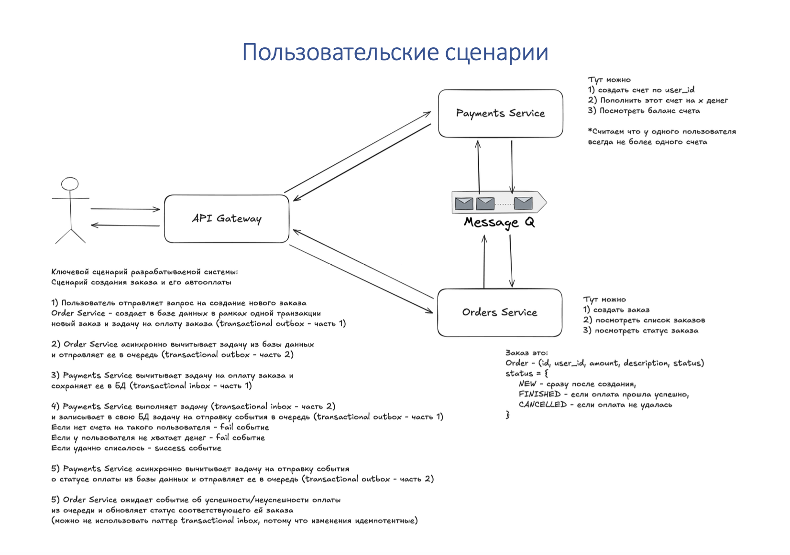

# Асинхронное межсервисное взаимодействие. Контрольная работа 3. Конструирование программного обеспечения.
## Интернет-магазин

## Описание проекта

Реализовано три микросервиса:

1. **API Gateway**  
   — точка входа, маршрутизация запросов к Order Service и Payments Service.

2. **Orders Service**  
   — управление заказами:
    - создание заказа (асинхронно запускает процесс оплаты)
    - получение списка всех заказов
    - получение статуса конкретного заказа

3. **Payments Service**  
   — управление счетами пользователей:
    - создание счёта (не более одного счёта на пользователя)
    - пополнение баланса
    - просмотр текущего баланса

Межсервисное взаимодействие построено через RabbitMQ с гарантией доставки и семантикой **exactly once** (Transactional Outbox/Inbox).

## Сценарии

## Компоненты

1. **API Gateway**
   - Порт: **5003**
   - Отвечает за маршрутизацию запросов к бэкенд-сервисам.
   - Эндпоинты:
     - `POST /orders` - создание заказа (если пользователь существует и у него достаточно баланса)
     - `GET  /orders` — список всех заказов
     - `GET  /orders/{id}` - заказ по id
     - `POST /accounts` — создание аккаунта
     - `GET  /accounts/{userId}/deposit` — пополнение баланса определенного аккаунта.
     - `GET  /accounts/{userId}` — получение информации об аккаунте (userId и баланс)
   - Swagger UI: `http://localhost:5003/index.html`

2. **OrderService**
   - Порт: **5001**
   - Создание заказа и хранение ее информации в PostgreSQL.
   - Эндпоинты:
      - `POST /api/Order` - создание заказа (если пользователь существует и у него достаточно баланса)
      - `GET  /api/Order` — список всех заказов
      - `GET  /api/Order/{id}` - заказ по id
   - Swagger UI: `http://localhost:5001/swagger`

3. **PaymentsService**
   - Порт: **5002**
   - Создание и хранение аккаунта в PostgreSQL.
   - Эндпоинты:
      - `POST /api/Accounts` — создание аккаунта
      - `GET  /api/Accounts/{userId}/deposit` — пополнение баланса определенного аккаунта.
      - `GET  /api/Accounts/{userId}` — получение информации об аккаунте (userId и баланс)
   - Swagger UI: `http://localhost:5002/swagger`

4. **PostgreSQL**
   - Два отдельных контейнера (для Order и Payments).
5. **RabbitMQ**
    - Для коммуникации PaymentsService и OrderService

## Документация
1.Swagger:
    * OrderService: `http://localhost:5001/swagger`
    * PaymentsService: `http://localhost:5002/swagger`
    * ApiGateway: `http://localhost:5003/index.html`

## Быстрый старт

1. Клонировать репозиторий и перейти в папку проекта:
   `git clone <repo-url>`
   `cd <repo-folder>`
2. Запустить всё через Docker Compose:
   `docker-compose up --build`